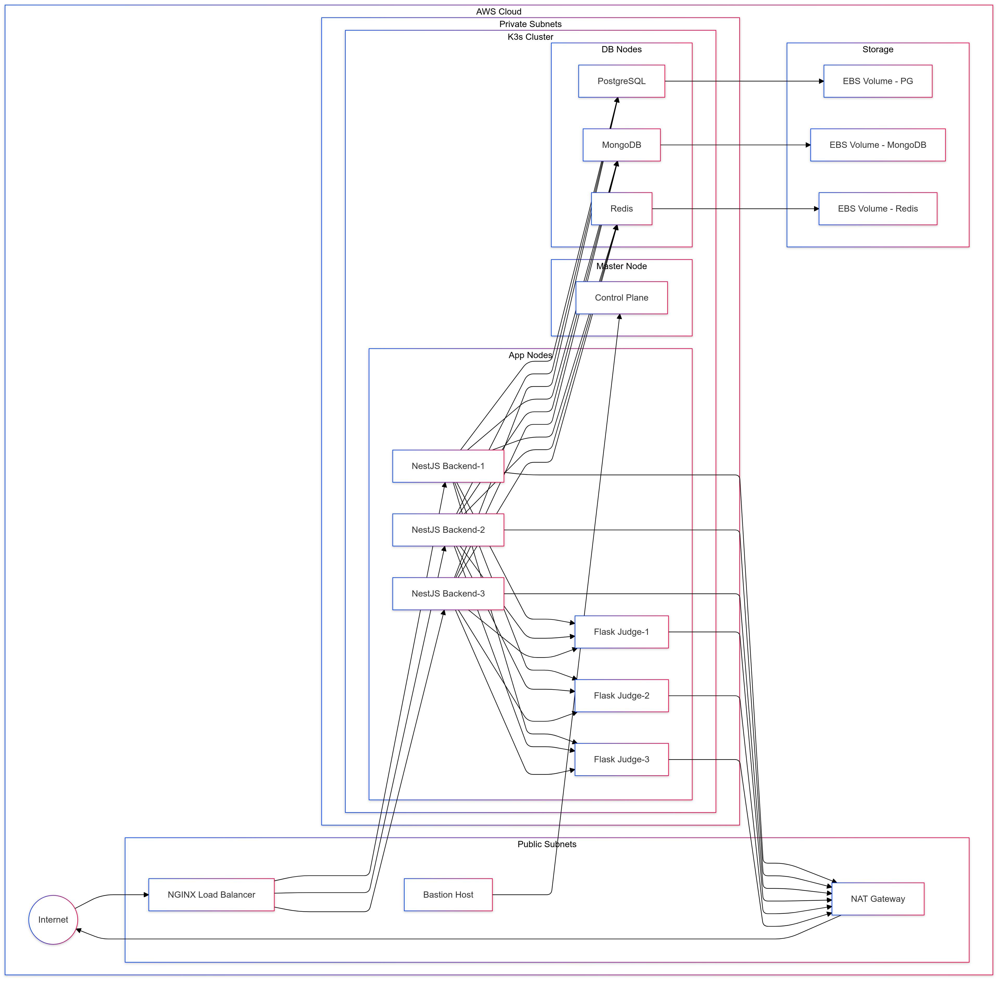

# JudgeBox Deployment

This repository manages the infrastructure and deployment of the JudgeBox platform using Terraform for infrastructure provisioning and Kubernetes for application deployment with high availability across multiple availability zones.

## Related Repositories
- [Judgebox-Backend (NestJS)](https://github.com/muazhussain/Judgebox-Backend) - Main application service
- [Judgebox-Judge (Flask)](https://github.com/muazhussain/Judgebox-Judge) - Code execution service

## Architecture Overview



The above diagram demonstrates the request flow in multi-node Kubernetes cluster.

### Infrastructure Components
- Multi-AZ VPC with public and private subnets
- NAT Gateways for private subnet internet access
- K3s Kubernetes cluster with dedicated nodes for applications and databases
- EBS CSI driver for persistent storage
- IAM roles for K3s node management

### Application Architecture
- Distributed workloads across multiple nodes
- High availability through pod anti-affinity
- Zero-downtime deployments with rolling updates
- Persistent storage for databases using EBS volumes
- Health monitoring and automatic recovery

## Repository Structure
```
judgebox-deployment/
├── terraform/
│   ├── main.tf           # Infrastructure configuration
│   ├── variables.tf      # Variable definitions
│   ├── outputs.tf        # Output definitions
│   └── versions.tf       # Provider versions
├── manifests/
│   ├── namespace.yaml    # Kubernetes namespace
│   ├── storage/
│   │   └── storage-class.yaml  # EBS storage configuration
│   ├── config/
│   │   ├── configmap.yaml      # Application configs
│   │   └── secrets.yaml        # Sensitive data
│   ├── databases/
│   │   └── databases.yaml      # Database StatefulSets
│   ├── applications/
│   │   └── applications.yaml   # Application Deployments
│   └── ingress/
│       └── nginx-config.yaml   # NGINX configuration
├── .github/
│   └── workflows/
│       ├── deploy.yaml     # Deployment workflow
│       └── destroy.yaml    # Cleanup workflow
└── README.md
```

## Infrastructure Details

### AWS Resources
- **VPC**: `10.0.0.0/16`
  - Public Subnets in multiple AZs
  - Private Subnets in multiple AZs
  - NAT Gateways for outbound internet access
  - Internet Gateway for public access

### Kubernetes Cluster
- **Master Node**: t3.medium in private subnet
- **Worker Nodes**: t3.medium in private subnets
  - Application nodes: Dedicated for NestJS and Flask services
  - Database nodes: Dedicated for stateful workloads

### Node Affinity Rules
- Applications run on nodes labeled `workload-type=app`
- Databases run on nodes labeled `workload-type=db`
- Pod anti-affinity ensures high availability

## Application Components

### Services
- **NestJS Backend**
  - Replicas: 3
  - NodePort: 30000
  - Rolling updates enabled
  - Resource limits and health checks

- **Flask Judge Service**
  - Replicas: 3
  - NodePort: 30001
  - Rolling updates enabled
  - Resource limits and health checks

### Databases (StatefulSets)
- **PostgreSQL**
  - Persistent storage: 10Gi EBS
  - Anti-affinity rules
  - Resource limits

- **MongoDB**
  - Persistent storage: 10Gi EBS
  - Anti-affinity rules
  - Resource limits

- **Redis**
  - Persistent storage: 5Gi EBS
  - Anti-affinity rules
  - Resource limits

## Deployment Guide

### Prerequisites
1. AWS Account with necessary permissions
2. GitHub repository with these secrets:
```
AWS_ACCESS_KEY_ID
AWS_SECRET_ACCESS_KEY
SSH_PRIVATE_KEY
SSH_PUBLIC_KEY
KNOWN_HOSTS
```

### Initial Setup
1. Generate SSH keys:
```bash
ssh-keygen -t rsa -b 4096 -f ~/.ssh/judgebox
```

2. Configure GitHub secrets:
   - Copy private key to SSH_PRIVATE_KEY
   - Copy public key to SSH_PUBLIC_KEY
   - Generate KNOWN_HOSTS after first deployment

### Deployment Process
1. **Infrastructure Deployment**:
```bash
# Via GitHub Actions
Navigate to Actions → Deploy Infrastructure and Application → Run workflow
```

2. **Verify Deployment**:
```bash
# Check node status
kubectl get nodes -o wide

# Check pod distribution
kubectl get pods -n judgebox -o wide

# Verify storage
kubectl get pv,pvc -n judgebox
```

### Monitoring and Logs
```bash
# Application logs
kubectl logs -n judgebox -l app=nestjs-backend
kubectl logs -n judgebox -l app=flask-judge

# Database logs
kubectl logs -n judgebox -l app=postgres
kubectl logs -n judgebox -l app=mongodb
kubectl logs -n judgebox -l app=redis
```

### Cleanup
```bash
# Via GitHub Actions
Navigate to Actions → Destroy Infrastructure → Run workflow
```

## Security

### Network Security
- All nodes in private subnets
- Internet access through NAT Gateways
- Security groups with minimal required access
- SSH access only through bastion host

### Data Security
- EBS volumes encrypted at rest
- Secrets managed through Kubernetes secrets
- Node-to-node encryption enabled
- IAM roles for service accounts

## License

This project is licensed under the MIT License.